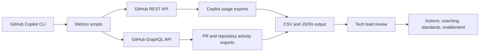

# Scenario 1: Engineering Metrics with GitHub Copilot CLI and GitHub APIs

## Goal

Help tech leads move from anecdotal productivity discussions to measurable engineering insights by combining GitHub Copilot CLI-assisted automation with GitHub REST and GraphQL APIs.

This scenario focuses on two categories of metrics:

1. **Copilot adoption and usage signals**: usage over time, active users, language/editor patterns, and acceptance trends where available.
2. **Engineering flow signals**: pull requests created per month, merged pull requests per month, review throughput, and repository-level activity.

## Why this matters for tech leads

Tech leads are often asked to answer questions such as:

- Are developers actually adopting GitHub Copilot?
- Which repositories or teams are increasing delivery throughput?
- Are PR volumes growing without review capacity?
- Is Copilot adoption correlated with faster delivery, better test coverage, or smaller PRs?
- Which teams need enablement, coaching, or workflow changes?

The answer should not be based only on impressions. A repeatable metrics workflow lets the tech lead use data to guide enablement, governance, and team conversations.

## Reference architecture



## Data sources

| Data source | Example signal | API pattern |
| --- | --- | --- |
| Copilot organization metrics | Active users, suggestions, acceptances, editor/language usage | `GET /orgs/{org}/copilot/metrics` |
| Copilot team metrics | Usage by team when supported and authorized | `GET /orgs/{org}/team/{team_slug}/copilot/metrics` |
| Pull request search | PRs created or merged per month | GitHub GraphQL `search` query |
| Repository metadata | Repository list and ownership scope | GitHub CLI / REST |

## Core workflow

1. Define the organization and repositories to analyze.
2. Use GitHub Copilot CLI to help generate or refine queries and scripts.
3. Run `scripts/collect-engineering-metrics.ps1`.
4. Review generated CSV and JSON outputs.
5. Compare Copilot adoption with PR activity trends.
6. Decide enablement actions for teams with low usage, review bottlenecks, or inconsistent practices.

## Example command

```powershell
.\scripts\collect-engineering-metrics.ps1 `
  -Organization "contoso" `
  -Repositories "contoso/api","contoso/web","contoso/mobile" `
  -MonthsBack 6 `
  -IncludeCopilotMetrics `
  -OutputDirectory ".\output"
```

## Suggested metrics

| Metric | Why it helps |
| --- | --- |
| PRs created per repository per month | Shows delivery volume and activity trends. |
| PRs merged per repository per month | Shows completed flow, not just started work. |
| Created-to-merged ratio | Highlights repositories where work accumulates without closure. |
| Copilot active users | Shows adoption breadth. |
| Copilot acceptance trend | Helps evaluate whether Copilot is producing useful suggestions. |
| Usage by editor/language | Helps target enablement by developer workflow. |

## Tech lead interpretation guide

| Signal | Possible interpretation | Suggested action |
| --- | --- | --- |
| High PR volume and low merge volume | Review bottleneck or large PRs | Coach smaller PRs, improve reviewer rotation, add automated checks. |
| Low Copilot usage in active repos | Adoption gap | Run enablement session, share prompts, configure repository instructions. |
| High Copilot usage but flat delivery metrics | Usage may be exploratory or blocked by process constraints | Inspect review latency, CI reliability, and requirement clarity. |
| High usage in one language only | Enablement may be uneven | Create language-specific examples and prompts. |

## Privacy and governance

- Prefer aggregated metrics over individual developer scorecards.
- Avoid using Copilot usage as an individual performance metric.
- Share trends with teams as a coaching tool, not as surveillance.
- Keep raw exports private and avoid committing generated output.

## Deliverables

- Monthly PR activity CSV.
- Copilot metrics JSON export when authorized.
- Tech lead summary of adoption, flow, and recommended actions.
- Backlog of enablement improvements.

